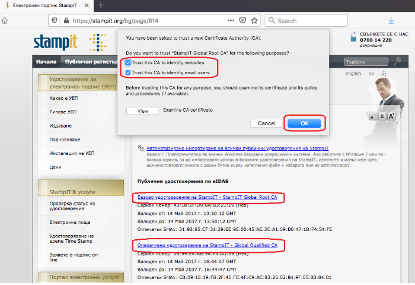
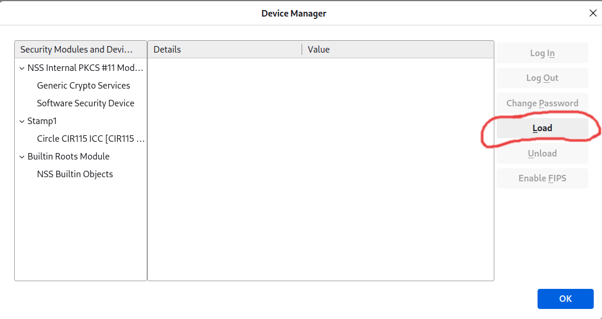
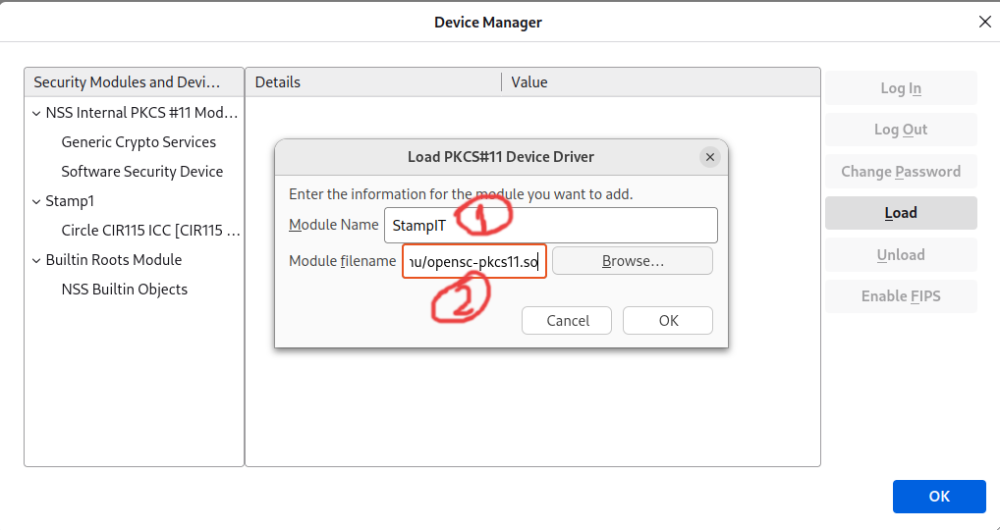
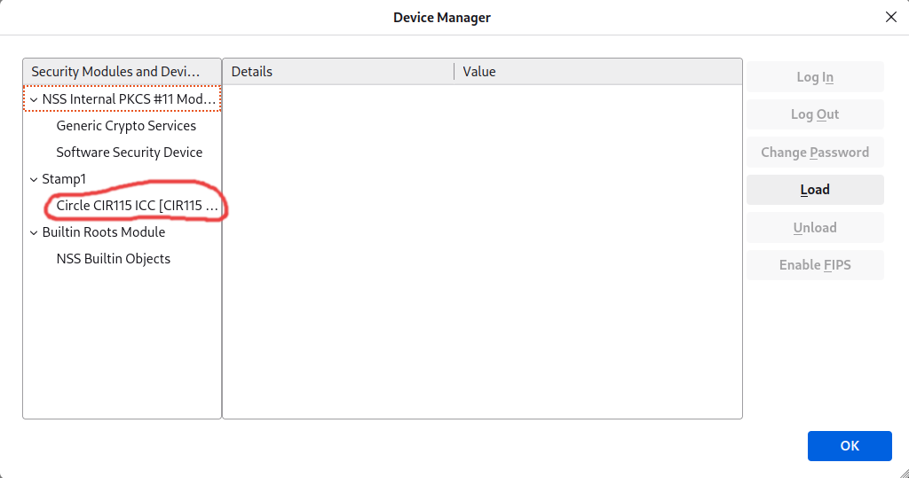
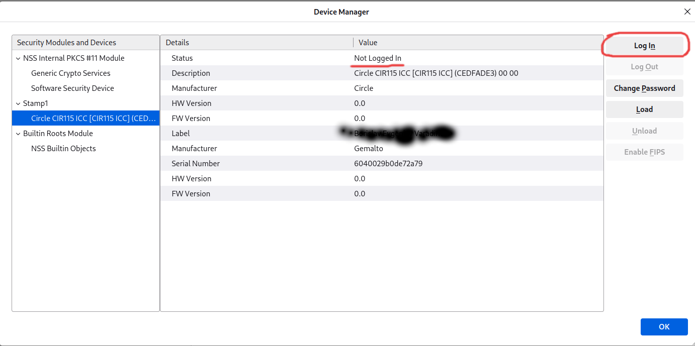
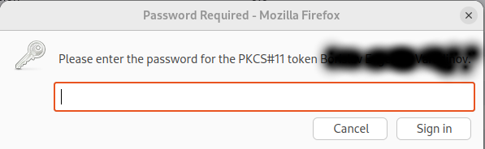
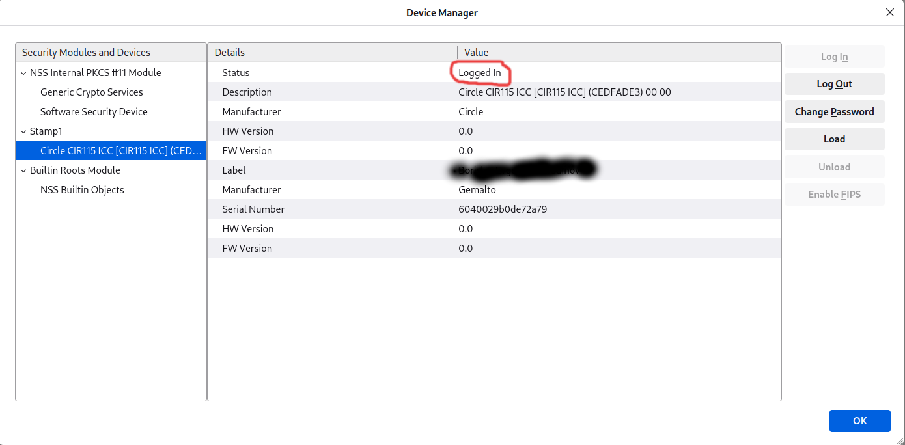

# Overview
This guide explains how to set up and use [StampIT](https://www.stampit.org/) Digital Signature Certificate (a.k.a. Квалифициран Електронен Подпис - КЕП).  
It is designed specifically Debian-based distributions.   

**Note:** If you want to use for RedHat-based or other distributions, you will need to find the right packages and drivers.  

# Install and Setup Prerequisites
## Required tools
* **pcscd** - background daemon that manages communication with smart card readers. It provides an interface for applications to interact with smart card hardware. It uses the low level PC/SC (Personal Computer/Smart Card) API for communication which allows digital signing using smart cards and other operations.

* **pcsc-tools** - A set of utilities for testing and debugging smart card readers. Includes tools like pcsc_scan that can be used to detect and interact with smart card readers connected to the system. Shows real-time information about card insertion, removal, and communication.

* **opensc** - Open-source tools and libraries for smart cards. Provides a programmatic way to interact with different types of smart cards. It supports PKCS#11, which is used for cryptographic operations. It allows the software to read/write data, manage certificates, and configure smart cards. It relies on pcscd (PC/SC Daemon) to handle the low-level communication with the smart card reader hardware.

* **libnss3-tools** - Provides command-line utilities for the Network Security Services (NSS) libraries. NSS is a set of libraries for supporting cryptographic security, including SSL/TLS and PKI. Adding or removing certificates from Firefox, Chromium, Thunderbird, Okular or other NSS-based applications.


```
+--------------------+
|   Application      |
|  (pkcs11 lib)      |
+--------------------+
          |
          v
+--------------------+
|  OpenSC Libraries  |
| (libopensc.so)     |
+--------------------+
          |
          v
+--------------------+
|   PC/SC Interface  |
| (libpcsclite.so)   |
+--------------------+
          |
          v
+--------------------+
|     pcscd Daemon   |
+--------------------+
          |
          v
+--------------------+
| Smart Card Reader  |
+--------------------+
```

## Install OS Packages
```bash
sudo apt install pcscd pcsc-tools opensc libnss3-tools
```

## Run pcscd daemon 
```bash
sudo systemctl start pcscd
sudo systemctl enable pcscd
```

## Download and install card reader drivers
StampIT are using **abcircle** card readers. If you are using other card reader, you need to find the relevant compatible driver for **pcscd**.
1. Open https://www.abcircle.co.jp/en/downloads/
2. Select proper device. You can check the sticker on the back of the card reader for the exact device ID (e.g. CIR115B) 
3. Download the zip package
4. Extract the zip
```bash
unzip <zipfile>.zip
```
5. Find the relevant **.deb** file for your OS in the extracted directory
6. Install the dep package 
```bash
dpkg -i <package>.deb
```

## Connect your reader
* Validate if your device is found
```bash
lsusb
```

* You should see something like this:

```
...
Bus 001 Device 008: ID 31aa:1000 Circle CIR115 ICC
...
```

## Validate pcsc finds the reader
* Run pcsc_scan
```bash
pcsc_scan -r
```

* You should see something like this:

```
0: Circle CIR115 ICC [CIR115 ICC] (CEDFADE3) 00 00
```

## Validate opensc finds the reader and the smart card
* Run opensc-tool -l
```bash
opensc-tool -l
```

* You should see something like this:

```
# Detected readers (pcsc)
Nr.  Card  Features  Name
0    Yes             Circle CIR115 ICC [CIR115 ICC] (CEDFADE3) 00 00
```

* Run opensc-tool -n
```bash
opensc-tool -n                                                                                                                               ✔  pydanticai-presentation-demo Py  at 
```

* You should see something like this:

```
Using reader with a card: Circle CIR115 ICC [CIR115 ICC] (CEDFADE3) 00 00
Gemalto IDPrime 940
```

# Firefox
* Firefox must be installed as normal os package (not snap or flatpak). 
* Firefox allows you to load external libraries for security devices.

## Install Firefox
* Remove the Snap Version of Firefox
First, uninstall the Snap version to avoid conflicts:
```bash
sudo snap remove firefox
```

* Ensure the keyring directory exists
```bash
sudo install -d -m 0755 /etc/apt/keyrings
```

* Import Mozilla’s Signing Key
```bash
wget -q https://packages.mozilla.org/apt/repo-signing-key.gpg -O- | \
sudo tee /etc/apt/keyrings/packages.mozilla.org.asc > /dev/null
```

* Add Mozilla’s APT Repository
```bash
echo "deb [signed-by=/etc/apt/keyrings/packages.mozilla.org.asc] \
https://packages.mozilla.org/apt mozilla main" | \
sudo tee /etc/apt/sources.list.d/mozilla.list > /dev/null
```

* Set Package Priority to Prefer Mozilla’s Repository
```bash
echo '
Package: *
Pin: origin packages.mozilla.org
Pin-Priority: 1000
' | sudo tee /etc/apt/preferences.d/mozilla
```

* Update Package Lists and Install Firefox
```bash
sudo apt update
sudo apt install firefox
```

## Install Public Certificates of StampIT
* Open https://www.stampit.org/en/page/814
* Download StampIT Global Root CA 
* Download StampIT Global Qualified CA
* Install the certificates 


## Add OpenSC lib
* Open **about:preferences#privacy** in Firefox 
* Find and click on Certificates -> Security Devices
* Click on load



* Enter Name (e.g. StampIT) and module filename **/usr/lib/x86_64-linux-gnu/opensc-pkcs11.so**. Then click OK. 



* Click on the added device



* Click on Login



* Use your PIN code



* You should see "Logged In"



  
Now you should be able to open any site that requires digital signature (КЕП) to login.   
You can test the process with [Egov](https://egov.bg/wps/portal/egov/vhod) -> Избор на средство за автентикация -> Квалифициран Ел. Подпис КЕП.

# OpenWeb Start Linux
Some gov applications in Bulgaria requires tools like OpenWeb Start to sign documents. They will prompt you to download the software. So you must download the tool and configure it to use the same library/module.

* Use OpenSC lib in OpenWeb Start
```
/usr/lib/x86_64-linux-gnu/opensc-pkcs11.so
```

# Add OpenSC library/module to NSSDB
NSS can be used by different tools for digital signing like Okular, Chromium and etc.

* Ensure all browsers and software that uses nssdb are closed
* Add the library to nssdb
```bash
modutil -dbdir sql:$HOME/.pki/nssdb -add "OpenSC" -libfile /usr/lib/x86_64-linux-gnu/opensc-pkcs11.so
```
* List the added certs
```bash
modutil -dbdir sql:$HOME/.pki/nssdb -list
```

# Okular
Okular is Universal Document Viewer that can sing PDFs. It uses NSS as signing backend so everything should be working fine if you followed the guide.
